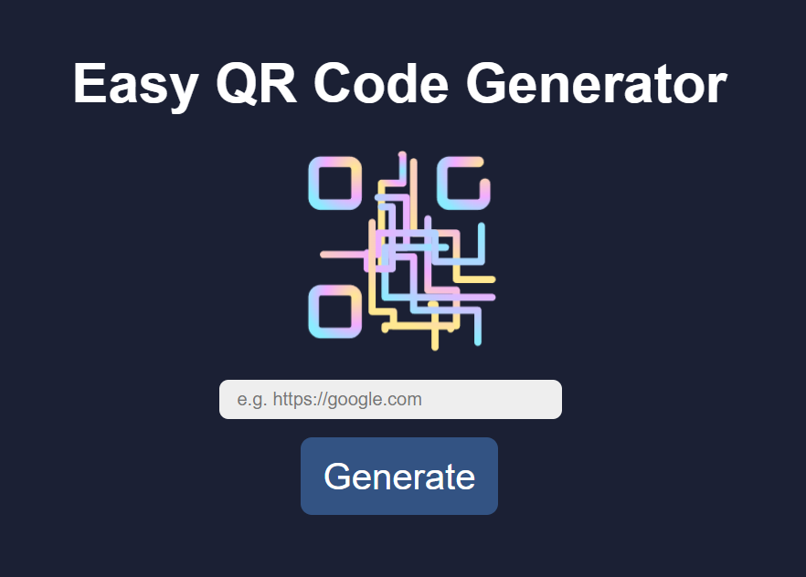

<h1 align="center">
  
</h1>

# QR Code Generator - Custom Hook Project

The essence of this project is to empower users to input a URL, effortlessly convert it into a QR code, and conveniently download it as an image.

### The Problem

The code was pretty much already in place so the thin to focus on was trying to make sence of the custom hook. There was a lot of hints this week, and I thin that made me a little confused. I notice that I don't "speak code" well enough to understand all the hints so there were discussions within the team, I googled a bit and used ChatGPT to explain.

This was the fist time I applied an animation from the Lottie library. Fun stuff! The only thing that's missing from that is I can't make the animation go slower. I think it's moving too fast, but I just can't figure out how to do that (withput paying).

### View it live

https://easy-qr-code-generator.netlify.app/

## Screenshot

